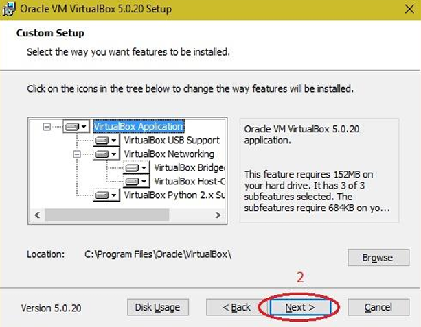
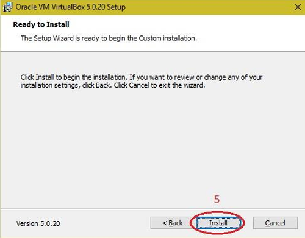

# 1. Install VirtualBox VMware Workstation with different flavors of Linux or Windows OS

## Aim

To Install Virtualbox / VMware Workstation with different flavours of linux or windows OS.

## Procedure

- Download the Virtual box exe and click the exe file…and select next button.

- Click the next button.

- Click the next button.

- Click the YES button.

- Click the install button…

- Then installation was completed. The show virtual box icon on desktop screen….

