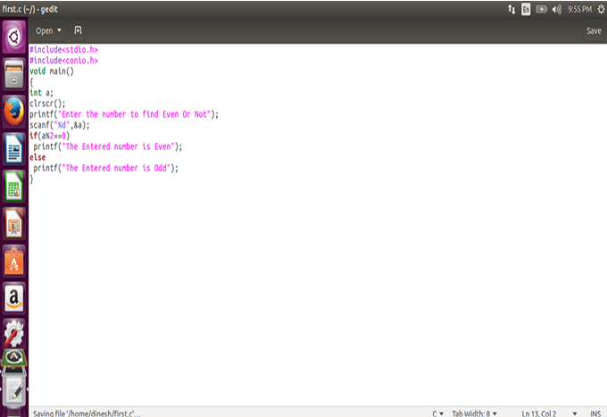
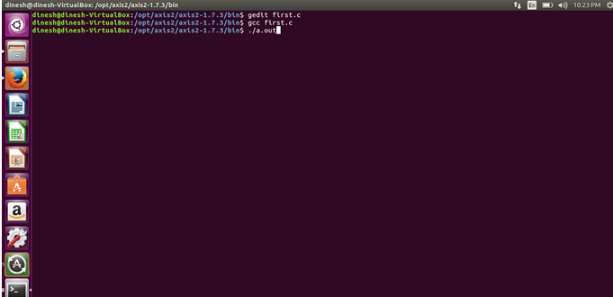

# 2. Install a C compiler in the virtual machine and execute a simple program

## Aim

To Install a C compiler in the virtual machine created using virtual box and executes Simple Program.

## Procedure

Steps to import Ubuntu file

- Open Virtual box
- File import Appliance
- Browse ubuntu_gt6.ova file
- Then go to setting, select USB and choose USB 1.1
- Then Start the ubuntu_gt6

### **Steps to run C program:**

1. Open the terminal

2. Type cd /opt/axis2/axis2-1.7.3/bin then press enter

3. gedit hello.c

4. gcc hello.c

5. ./a.out

#### Type gedit first.c

#### Type the C program

#### Running the C program

#### Display the output:

