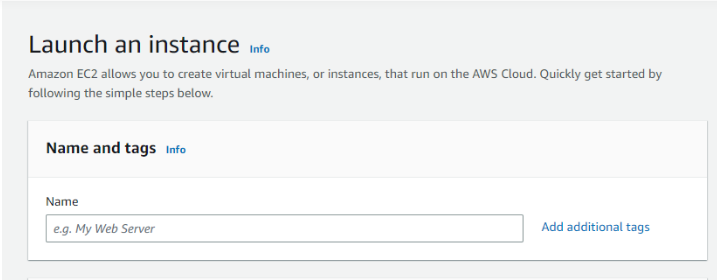
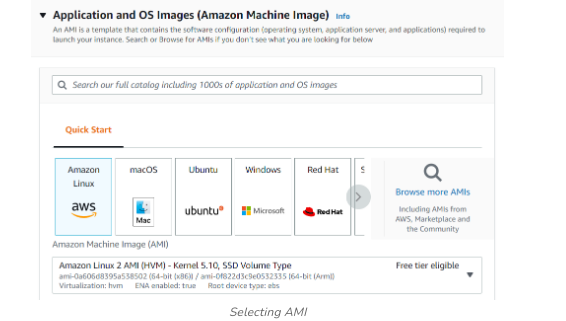

# 3. Create EC2 Instance in AWS (Amazon)

## Aim

Create EC2 Instance in AWS (Amazon)

## Procedure

The following are the steps for creating an EC2 instance in AWS (Amazon):

**Step 1: First, log into your AWS account and click on “services” present on the left of the AWS management console, i.e. the primary screen. From the drop-down menu of options, tap on “EC2”. To create an AWS free tier account refer to Amazon Web Services (AWS) – Free Tier Account Set up.**

**Step 2: Click on the launch instance click on the launch instance, after clicking on it you will be redirected to a launch page where we can create an instance. Configure all the requirements to Create a new instance like the name of the instance as shown in the figure below.**

**Step 3: Select AMI – Required operating system from the available. There are different types of OS available select the OS as per your requirement.**

**Step 4: By default, it selects a free tier of storage. (IF YOU ARE ELIGIBLE FOR THE FREE TIER). From the available storage specifications, select a free tier-eligible storage service. The instance type includes the number of CPUs required and the Memory required for your application. By default, the instance type is “t2.micro” which is a free tier-eligible service. Do not select any other which leads to the billing amount. To know more about instance types refer to Amazon EC2 – Instance Types.**

**Step 5: Keep the network settings as default settings and make changes if required.StorageAs mentioned in the picture, Free tier eligible can get up to 30 GB of EBS Storage. Keep it as default.**

**Step 6: Launching Instance At last, Check if all the selected are eligible for a free tier or not and click on “Launch instance”.That’s it, an instance will be created.**

### Steps To Connect Terminal Using SSH-Key:

**Step 1: Select the server to which you want to connect and click on the connect button at the top of that instance as shown in the image below.**

**Step 2: Copy the SSH key which is right following the example it will acct as a key-pair to connect to EC2-Instance.**

**Step 3: Open the terminal and go to the folder where your .pem file is located and paste the key that you have copied in AWS and paste it in the terminal.**

