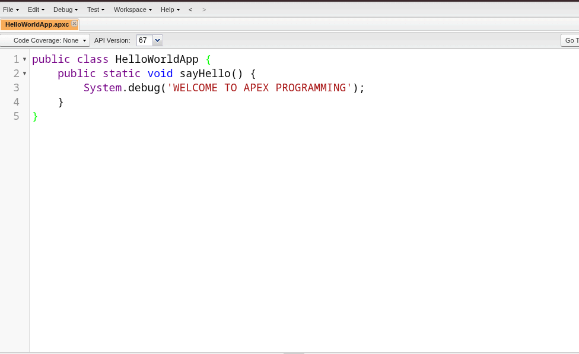
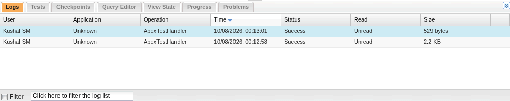
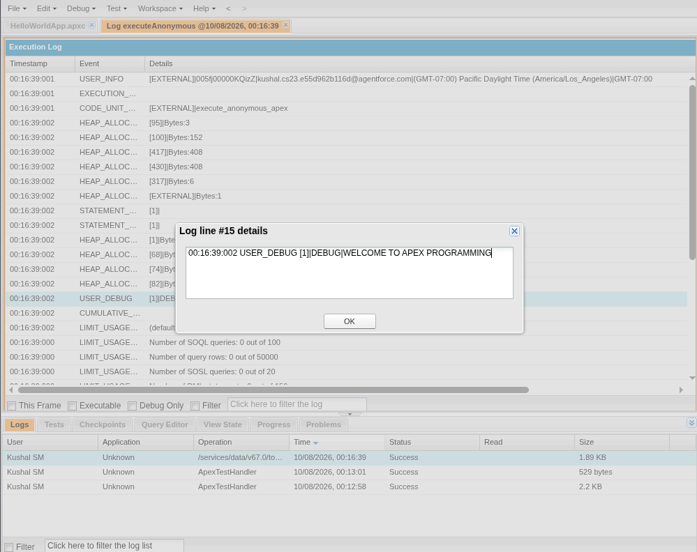

# 4. Develop a simple application using Apex programming language of salesforce.com

## Aim

To develop a simple custom application using the Apex programming language on the Salesforce cloud platform.

## Procedure

**Step 1: Sign up for a Salesforce Developer Org: If you don't have one, sign up for a free developer account on the Salesforce Signup Page.**

**Step 2: Log in to your Developer Org: Access your Salesforce instance with your credentials.**

**Step 3: Open the Developer Console: Click the gear icon (Setup) in the top-right corner of the Salesforce Classic interface or the top-left in Lightning Experience, and then select Developer Console.**

**Step 4: Create a New Apex Class:**

- In the Developer Console, navigate to File > New > Apex Class.
- Enter a name for your class (e.g., HelloWorldApp) and click OK.

**Step 5: Write the Apex Code: A basic class structure will be automatically generated. Add a method within the curly braces to perform a simple action, such as printing a message to the debug log.**

Apex Code (see [code/HelloWorldApp.cls](code/HelloWorldApp.cls)):

```apex
public class HelloWorldApp {
    public static void sayHello() {
        System.debug('WELCOME TO APEX PROGRAMMING');
    }
}
```



Ensure you click File > Save to save your new class.

**Step 6: Execute the Apex Code:**

- In the Developer Console, click the Debug menu and select Open Execute Anonymous Window.
- In the window that opens, enter the following code to call your method:

Apex Code (see [code/ExecuteAnonymous.apex](code/ExecuteAnonymous.apex)):

```apex
HelloWorldApp.sayHello();
```



- Ensure the Open Log checkbox is selected and click the Execute button.

**Step 7: View the Output: The execution log will open automatically. To see only your output, ensure the Debug Only checkbox is selected in the log inspector. Your message "WELCOME TO APEX PROGRAMMING" will be displayed in the log.**


