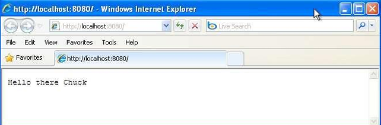
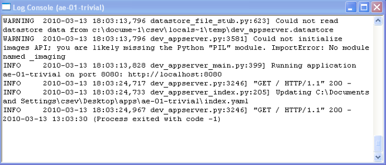
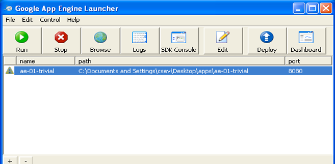

# 9. Use Google App Engine Launcher to launch web applications

## Aim

To use Google App Engine Launcher to launch web applications.

## Procedure

**Prerequisites:** Install [Python 2.7](https://www.python.org/download/releases/2.7/) and download the [Google App Engine Launcher](https://drive.google.com/file/d/1Uuxc9PTDHZ_l7zOxBnKfn4XbBnd0iLtK/view).

**Step 1: Create the application folder**

Under `C:\Documents and Settings\csev\Desktop\apps`, create a sub-folder called `ae-01-trivial`. The full path to this folder would be:

```
C:\Documents and Settings\csev\Desktop\apps\ae-01-trivial
```

Use a text editor such as [JEdit](http://www.jedit.org) to create the application files.

**Step 2: Create `app.yaml`**

Inside the `ae-01-trivial` folder, create a file called `app.yaml` with the following contents (see [code/app.yaml](code/app.yaml)):

```yaml
application: ae-01-trivial
version: 1
runtime: python
api_version: 1
handlers:
- url: /.*
  script: index.py
```

**Step 3: Create `index.py`**

In the same folder, create a file called `index.py` with the following three lines (see [code/index.py](code/index.py)):

```python
print 'Content-Type: text/plain'
print ''
print 'Hello there Chuck'
```

**Step 4: Add the application to the launcher**

Start the GoogleAppEngineLauncher program found under Applications. Use **File → Add Existing Application**, navigate into the `apps` directory, and select the `ae-01-trivial` folder.

Once added, select the application so that you can control it using the launcher.


**Step 5: Run the application**

Select your application and press **Run**. After a few moments the application will start and the launcher will show a green icon next to it.

Press **Browse** to open a browser pointing at your application, running at `http://localhost:8080/`. You should see your application as follows:



Edit `index.py` to change the name "Chuck" to your own name, then press **Refresh** in the browser to verify your updates.

**Step 6: Watch the log**

You can watch the internal log of the actions the web server performs while you interact with your application in the browser.

Select your application in the Launcher and press the **Logs** button to bring up a log window. Each time you press **Refresh** in your browser, you can see it retrieving the output with a GET request.



**Step 7: Deal with errors**

With two files to edit, there are two general categories of errors you may encounter:

- If you make a mistake in `app.yaml`, the App Engine will not start, and your launcher will show a yellow icon near your application:



- To get more detail on what is going wrong, take a look at the log for the application:


## Result

Thus the GAE web applications were created.
